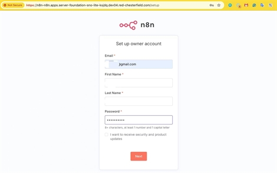
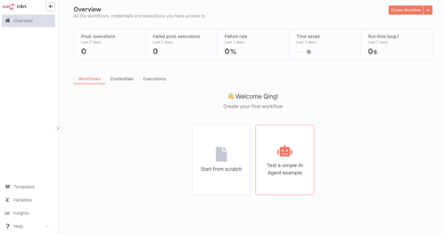

# Deploy n8n-Hosting on OpenShift to Enable an Active n8n Service

## The problem I was facing
n8n is an open-source, fair-code workflow automation platform with native AI capabilities. The community version is usually deployed on localhost for trial and development purposes. However, the most powerful aspect of n8n is its workflow automation capabilities, and deploying on localhost means workflows are not active when your machine is offline. To overcome this limitation and ensure continuous workflow execution, I explored deploying n8n on OpenShift to create a persistent, always-available automation service.

## What I did
### Prerequisites
You already have an OpenShift cluster deployed and accessible.

### Clone the configuration repository
Clone the repository with the following command:

```
$ git clone git@github.com:haoqing0110/n8n-hosting.git -b br_openshift
```
And change the directory to the root of the repository you cloned:
```
$ cd n8n-hosting/openshift
```

### Configure Postgres
**Configure volume for persistent storage:** The PVC is defined in the postgres-claim0-persistentvolumeclaim.yaml manifest. You can define the storage class or use the default value.

**Postgres environment variables:** Postgres needs some environment variables set to pass to the application running in the containers. You need to replace the placeholders  postgres-secret.yaml with values of your own for user details and the database to use. For example:
```
stringData:
  POSTGRES_USER: admin
  POSTGRES_PASSWORD: Letmein123
  POSTGRES_DB: n8n
  POSTGRES_NON_ROOT_USER: user1
  POSTGRES_NON_ROOT_PASSWORD: user1
```

### Configure n8n
**Setup custom domain:** The Webhook is default using localhost, you need to replace the placeholders of n8n-deployment.yaml to set up WEBHOOK_URL and N8N_EDITOR_BASE_URL with your custom domain.

For example:
```
  - name: N8N_EDITOR_BASE_URL
    value: https://n8n-n8n.apps.server-foundation-sno-lite-kxjdq.dev04.red-chesterfield.com
  - name: WEBHOOK_URL
    value: https://n8n-n8n.apps.server-foundation-sno-lite-kxjdq.dev04.red-chesterfield.com
```

### Deploy
**Deployments:** The two deployment manifests (`n8n-deployment.yaml` and `postgres-deployment.yaml`) define the n8n and Postgres applications to Kubernetes.

**Services:** The two service manifests (`postgres-service.yaml` and `n8n-service.yaml`) expose the services to the outside world using the Kubernetes load balancer using ports `5432` and `5678` respectively by default.

**Route:** The route manifest (`n8n-route.yaml`) expose the n8n as route so you can access from the URL.

Run the following command to deploy resources on your cluster:
```
kubectl apply -f namespace.yaml
kubectl apply -f .
```

### Verify
```
$ oc get route -n n8n
NAME   HOST/PORT                                                                  PATH   SERVICES   PORT   TERMINATION     WILDCARD
n8n    n8n-n8n.apps.server-foundation-sno-lite-kxjdq.dev04.red-chesterfield.com          n8n        5678   edge/Redirect   None

$ oc get pods -n n8n
NAME                        READY   STATUS    RESTARTS      AGE
n8n-86685566cd-ms26s        1/1     Running   0             80s
postgres-579dcddf6f-8r92g   1/1     Running   1 (73s ago)   88s
```

### Access n8n
**Time to access your n8n instance!**

Get the URL from your route with this command:

```
$ oc get route -n n8n
NAME   HOST/PORT                                                                  PATH   SERVICES   PORT   TERMINATION     WILDCARD
n8n    n8n-n8n.apps.server-foundation-sno-lite-kxjdq.dev04.red-chesterfield.com          n8n        5678   edge/Redirect   None
```

**First-time setup adventure:** When you first log in to n8n, you'll need to set up an owner account. It's important to remember your email and password, as these will be used when logging in the future.



**You're all set!** After completing the setup, you'll land on the n8n dashboard, where you can start building your first workflow. Welcome to the wonderful world of workflow automation!




