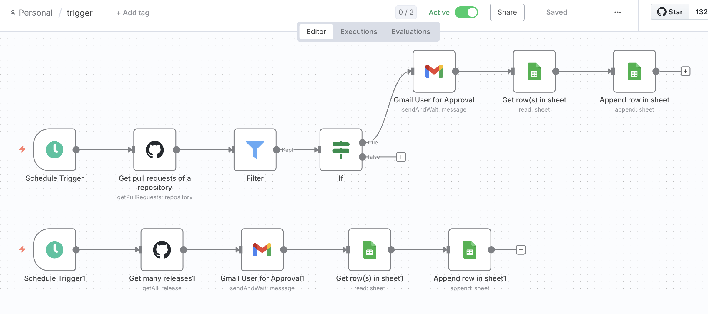
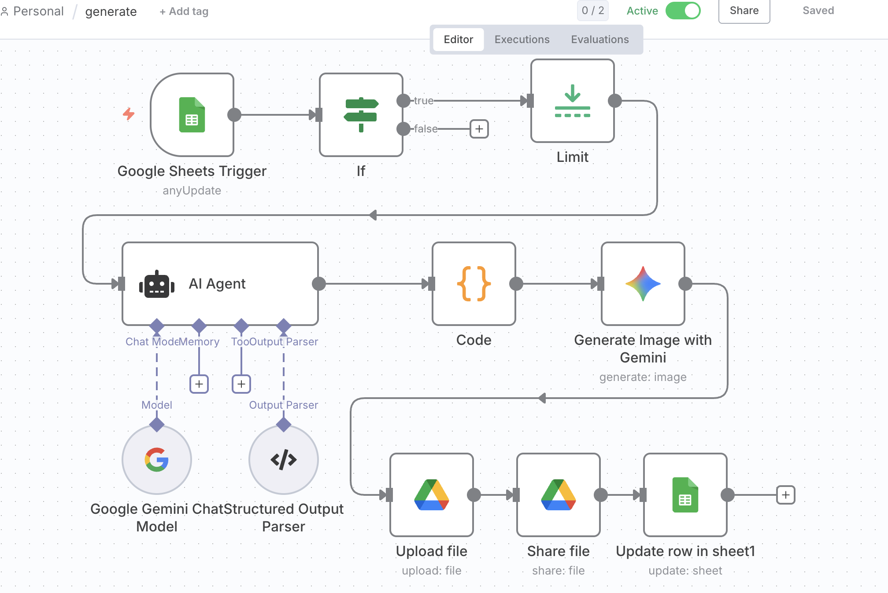
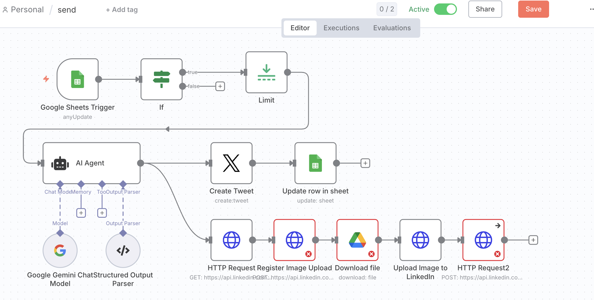

# Human in the Loop: Community Social Media Content Creation and Post with n8n

## The problem I was facing

After successfully [deploying n8n on OpenShift](./deploy_n8n_hosting_on_openshift_to_enable_an_active_n8n_service.md) to ensure our workflows stay active 24/7, I was ready to tackle the next challenge: automating our community's social media management.

As a maintainer of the OCM.io community, I found myself constantly juggling multiple social media platforms - Slack, LinkedIn, Twitter, and others - trying to keep our community updated about the latest developments. Every time we merged a significant PR, released a new version, or had important announcements, I had to manually craft different messages for each platform, considering their unique character limits, audience expectations, and posting formats.

The process was exhausting: monitoring GitHub for updates, writing tailored content for each social media platform, and posting everything individually while trying to maintain consistent messaging. I was either missing important updates or spending hours on repetitive social media tasks. There had to be a better way to automate this process while still maintaining the quality and human touch our community deserved.

## What I did

I decided to build a "Human in the Loop" automation system using n8n that would handle the repetitive tasks while keeping me in control of the important decisions. The goal was simple: with just one approval, or by automatically detecting community updates, AI would write the posts, I'd review them, and then they'd automatically go out to all our social media platforms.

### Step 1: Set up the Trigger Workflow - Watch and Request Approval



The first workflow monitors our GitHub repositories for important community updates:
- Pull requests being merged
- New releases being published  
- Important repository changes

When something significant happens, the workflow automatically captures the details and sends me an approval request via Gmail. This way, I stay in control of what gets promoted without having to constantly monitor GitHub myself.

### Step 2: Create the Generate Workflow - AI Content Creation with Human Review



Once I approve an update, the second workflow kicks in:
- AI generates platform-specific social media content
- Creates different versions for Twitter (respecting character limits), LinkedIn (professional tone), and Slack (community style)
- Sends the generated content to me for review and editing
- Lets me refine, approve, or reject the AI-generated content

This gives me the best of both worlds - AI efficiency with human creativity and oversight.

### Step 3: Build the Post Workflow - Multi-Platform Distribution



After I approve the content, the final workflow handles all the posting:
- Automatically distributes content to multiple social media platforms
- Maintains consistent messaging across all channels
- Provides confirmation that posts were successful
- Handles platform-specific formatting requirements

### The workflow architecture

The complete system works as three connected n8n workflows:

```
GitHub Events → Trigger Workflow → Gmail Approval
     ↓ (if approved)
AI Content Generation → Generate Workflow → Human Review
     ↓ (if approved)
Multi-Platform Posting → Post Workflow → Social Media Platforms
```

## What I achieved

This automation system completely transformed how I manage the OCM.io community's social media presence:

**Time savings:** From spending hours each week on social media management to just minutes of review time
**Better coverage:** Consistent posting across all platforms means our community updates reach everyone
**Faster response:** Community updates go out immediately after approval, keeping our audience engaged
**Quality maintained:** AI assistance combined with human oversight ensures our content stays on-brand and relevant

The best part is that I'm still in control of everything important - I decide what gets promoted and can edit any content before it goes live. The system just handles all the repetitive, time-consuming tasks that were eating up my time.

---

*Want to learn more about n8n automation workflows? Check out our previous posts on [n8n deployment](./deploy_n8n_hosting_on_openshift_to_enable_an_active_n8n_service.md) and other automation use cases.*